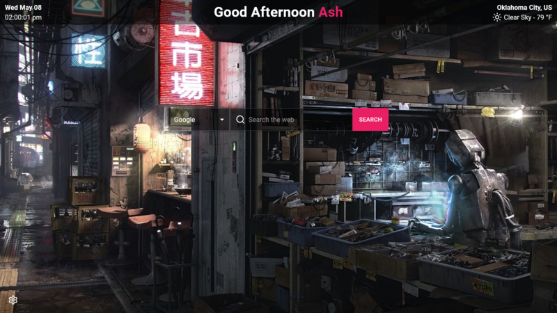
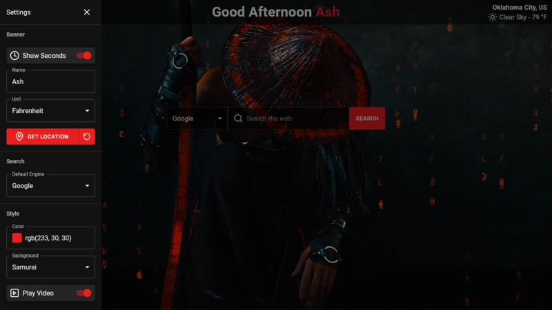

<div align="center">
  
  <h1>Start Page</h1>
  <p>
     Welcome to your personalized gateway to the web with Start Page!
  </p>
  <h4>
    <a href="https://github.ashthe.dev/start/">View Demo</a>
    &emsp;&emsp;
    <a href="https://github.com/AshtonHeald/todo/issues/new">Report Bug</a>
  </h4>
</div>

## Table of Contents
- [About](#about)
  - [Screenshots](#screenshots)
  - [Description](#description)
  - [Features](#features)
  - [Tech Stack](#tech-stack)
- [Getting Started](#getting-started)
  - [Prerequisites](#prerequisites)
  - [Installation](#installation)
  - [Development](#development)
  - [Deployment](#deployment)
- [License](#license)

<!-- About -->
##  About
### Screenshots
  
|||
|:---:|:---:|

### Description
  <p>Start Page simplifies your browsing experience by serving as a customizable start page for any web browser. With streamlined access to web engines, it eliminates unnecessary steps for users. Enjoy a cozy atmosphere with personalized greetings, accurate datetime and weather data, and background options with moving visuals. Tailor your experience further with easy-to-use customization settings that persist with localstorage.</p>

> [!NOTE]
>This app uses local storage, settings will not carry over to/from other web browsers.

### Features

<dl>
  <dt>Dynamic Search Bar</dt>
  <dd>Quickly search various engines from around the web with ease and efficiency.</dd>
  <dt>Date Local Time</dt>
  <dd>Utilizes day.js and the user's system to fetch and display the current date and time accurately.</dd>
  <dt>Dynamic Greeting</dt>
  <dd>Personalized greeting that adapts based on the time of day, providing a warm and welcoming user experience.</dd>
  <dt>Location</dt>
  <dd>Utilizes OpenWeather's Geo API to accurately determine and display the user's location.</dd>
  <dt>Weather</dt>
  <dd>Fetches current weather conditions based on the user's location using OpenWeather's Weather API.</dd>
  <dt>Custom Settings</dt>
  <dd>Empowers users to personalize their experience by utilizing local storage to persist changes to app settings, including display, data, and style preferences</dd>
</dl>

### Tech Stack

<div>


</div>

<p><b>Other:</b> OpenWeather, Lucide, Fontsource, DayJS, Mui-Color-Input</p>

<!-- Getting Started -->
##  Getting Started
### Prerequisites
This project uses pnpm as package manager
```bash
 npm install --global pnpm
```

### Installation

Clone the repository
```bash
git clone https://github.com/AshtonHeald/start.git
```

Install dependencies
```
pnpm install
```

### Development

Start Vite dev server in the current directory.
```bash
pnpm run dev
```

Locally preview the production build. Do not use this as a production server as it's not designed for it.
```bash
pnpm run preview
```

### Deployment

Build for production. [Static Deploy](https://vitejs.dev/guide/static-deploy.html)
```bash
pnpm run build
```

---

<!-- Licence -->
### License

Distributed under the MIT License. See `LICENSE.md` for more information.
